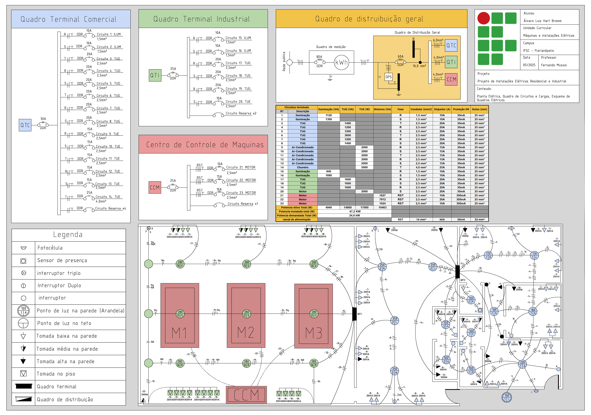
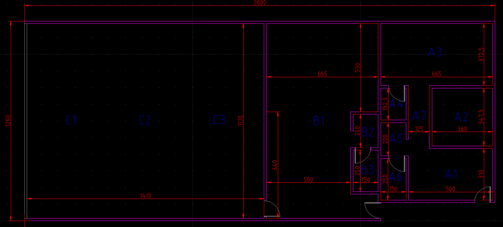
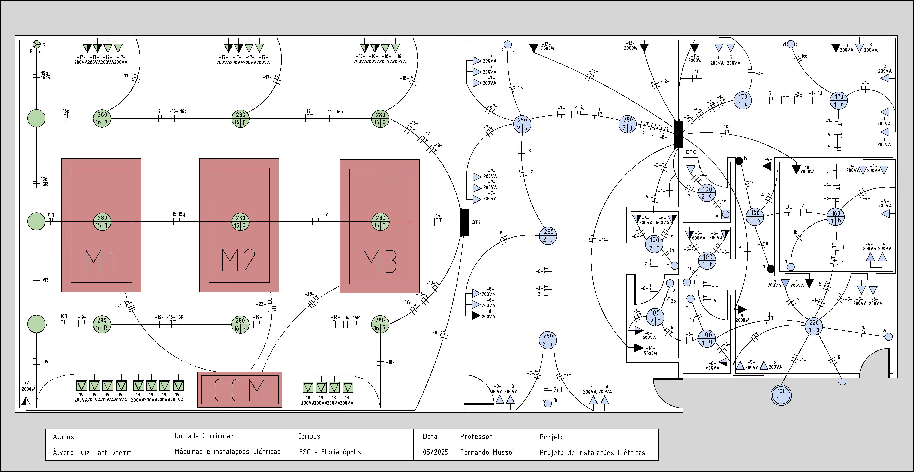
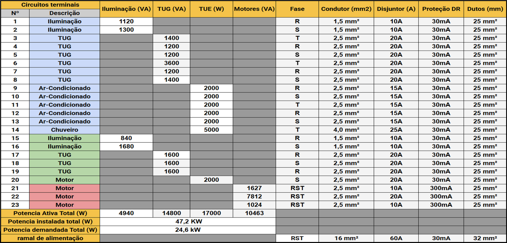

# Planta eletrica industrial com quadro de cargas
Projeto acadêmico desenvolvimento utilizando FreeCAD durante a disciplina `maquina e acionamentos` de uma planta elétrica industrial
e comercial completa, incluindo quadro de cargas, dimensionamento de circuitos e dispositivos de proteção, com foco em aplicações industriais.

 

<b>planta elétrica</b>

# Parametros e Restrições

 

 

 

A planta do projeto se trada de um edificio hipetético, sendo igual para todos os alunos, diferindo-se levemente a depender de como o aluno reproduziu o desenho em softwares como AutoCAD ou FreeCAD. O layout do projeto se trada de um edificio hipetético

<!-- Layout original -->

Devido a extensão deste projeto em conjunto de demais projetos da mesma disciplina, o professor regente autorizou a simplificação de certos cálculos. Para a corrente de dimensionamento foi adicionado um fator de margem de segurança de 25% para substituir fatores de agrupamento e de temperatura em relação a espessura da bitola do ramal.
